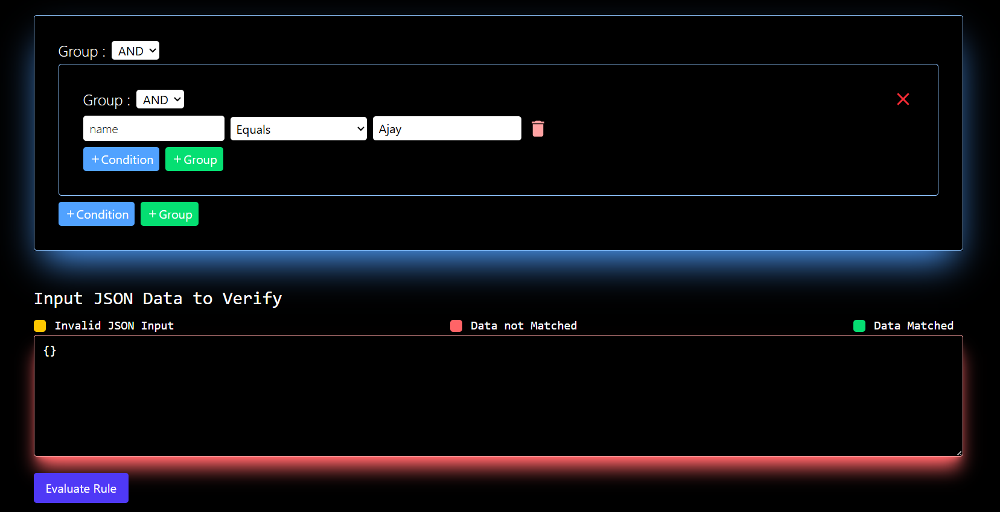

# Rule Engine Web Application

### Live : https://rule-engine-two.vercel.app/

## Overview

This project is a frontend web application for defining and evaluating complex rules against JSON data. It provides a user-friendly interface to create rule sets with nested conditions and logical operators, enabling dynamic decision-making without hardcoding logic.

**Note: This is a work-in-progress.  The current version is a frontend-only application.  Future development will integrate a backend service to persist and manage rules.**

## Features

* **Interactive Rule Definition:**
    * Users can define rules using an intuitive UI.
    * Supports nested rule groups for creating complex logic.
    * Ability to add conditions with attributes, operators (equals, greaterThan, lessThan, etc.), and values.
* **Dynamic Rule Evaluation:**
    * Evaluates defined rules against user-provided JSON data.
    * Provides feedback on whether the data matches the rules.
* **Abstract Syntax Tree (AST) -like Structure:**
    * While not a traditional AST parser, the application uses a nested object structure to represent rules, effectively achieving a tree-like representation for complex rule logic.
* **Frontend Implementation:**
    * Built with React and Tailwind CSS.
    * Responsive design for various screen sizes.

## Technologies Used

* React
* Tailwind CSS
* uuid (for unique IDs)

## Screenshots

*`*

## Setup (Frontend Only)

Since this is a frontend-only application, you can set it up as follows:

1.  **Clone the repository:**
    ```bash
    git clone https://github.com/AJAYKUMAR-01/Rule_Engine
    cd Rule_Engine
    ```
2.  **Install dependencies:**
    ```bash
    npm install  # or yarn install
    ```
3.  **Run the application:**
    ```bash
    npm start  # or yarn start
    ```
    The application will be accessible at `http://localhost:5173` (or a similar address).

## How to Use (Frontend)

1.  **Define Rules:** Use the interactive UI to create your rule set. You can add rule groups (AND/OR) and individual conditions.
2.  **Provide Input JSON:** Enter the JSON data you want to evaluate against the defined rules in the text area.
3.  **Evaluate:** Click the "Evaluate Rule" button.
4.  **View Result:** The application will display whether the input JSON matches the defined rules.

## Future Development

This project is under active development. The following features are planned:

* **Backend Integration:** A backend service will be added to persist and manage rules. This will allow users to save and reuse rule sets.
* **Database Integration:** A database (likely PostgreSQL or MongoDB) will be used to store rules and related data.
* **API Development:** A RESTful API will be created to interact with the rule engine.
* **User Authentication:** User authentication and authorization will be implemented.
* **More Rule Operators:** Support for a wider range of rule operators (e.g., `contains`, `in`, `not equals`) will be added.
* **Rule Versioning:** The ability to version rules will be added.

## Contributing

Contributions are welcome!  However, please note that the architecture is subject to change as the backend integration is implemented.  If you'd like to contribute, please:

1.  Fork the repository.
2.  Create a branch for your feature (`git checkout -b my-new-feature`).
3.  Commit your changes (`git commit -am 'Add some feature'`).
4.  Push to the branch (`git push origin my-new-feature`).
5.  Create a new Pull Request.

